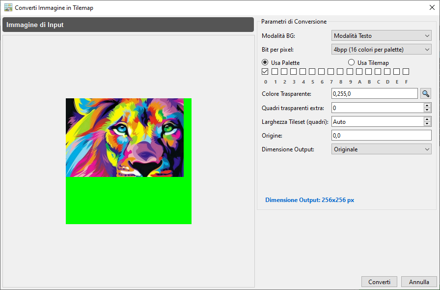
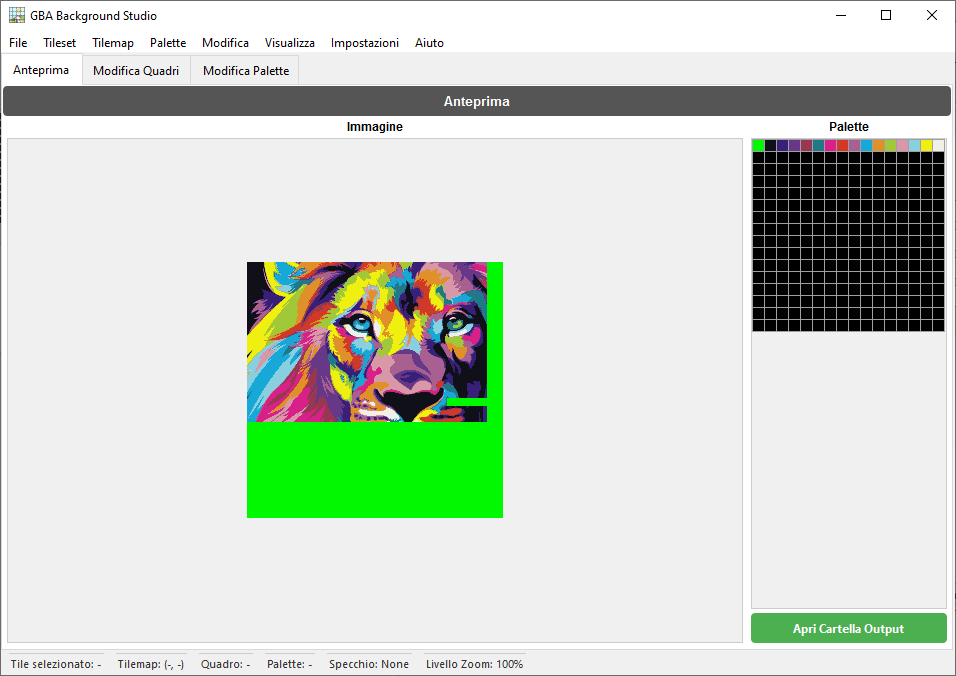
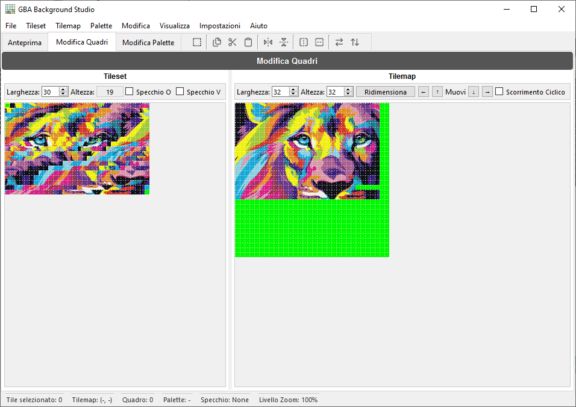
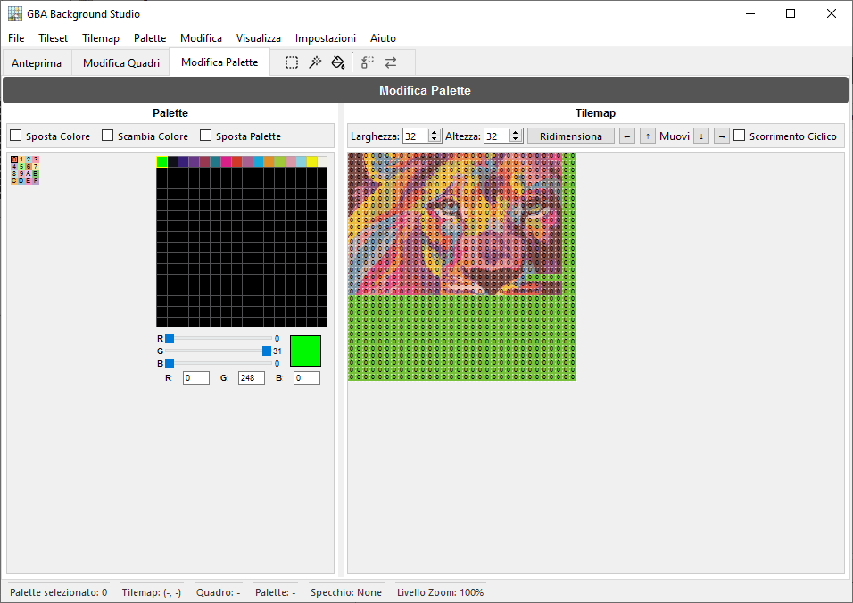

<p align="center"></p>
<div align="center"><a href="https://discord.gg/wsFFExCWFu"></a></div>

## GBA Background Studio

**GBA Background Studio** è un'applicazione desktop per creare e modificare **sfondi per Game Boy Advance (GBA)**. Permette di convertire immagini in tileset e tilemap compatibili con GBA, modificare visivamente quadri e palette, ed esportare asset pronti all'uso per i tuoi progetti GBA.

> ⚠️ Questa applicazione è progettata per sviluppatori, ROM hacker e pixel artist che necessitano di un controllo preciso sugli sfondi GBA.

---

## 🌐 Traduzioni

Questo README è disponibile nelle seguenti lingue:

<p align="center">
  <a href="README.md">English</a> | <a href="README.spa.md">Español</a> | <a href="README.brp.md">Português (BR)</a> | <a href="README.fra.md">Français</a> | <a href="README.deu.md">Deutsch</a> | <a href="README.ita.md">Italiano</a> | <a href="README.por.md">Português</a> | <a href="README.nld.md">Nederlands</a> | <a href="README.pol.md">Polski</a><br>
  <a href="README.tur.md">Türkçe</a> | <a href="README.vie.md">Tiếng Việt</a> | <a href="README.ind.md">Bahasa Indonesia</a> | <a href="README.hin.md">हिन्दी</a> | <a href="README.rus.md">Русский</a> | <a href="README.jpn.md">日本語</a> | <a href="README.zhs.md">简体中文</a> | <a href="README.zht.md">繁體中文</a> | <a href="README.kor.md">한국어</a>
</p>

---

## ✨ Caratteristiche

- **Conversione da immagine a GBA**
  - Converte immagini standard in tileset e tilemap compatibili con GBA.
  - Configura la dimensione di output e la profondità di colore (4bpp e 8bpp).
  - Anteprima del risultato prima dell'esportazione.

- **Modifica Quadri**
  - Selezione e modifica visiva dei quadri.
  - Strumenti di disegno interattivi sulla griglia della tilemap.
  - Livelli di zoom dal 100% all'800% per la modifica pixel per pixel.

- **Modifica Palette**
  - Modifica fino a 256 colori per palette.
  - Sincronizza le modifiche della palette con le anteprime e i quadri.
  - Riordina, sostituisce o regola i colori individuali.

- **Scheda Anteprima**
  - Visualizza come apparirà il tuo sfondo finale su uno schermo simile al GBA.
  - Valida rapidamente le configurazioni di quadri e palette.

- **Cronologia Annulla/Ripristina**
  - Tracciamento completo della cronologia delle modifiche.
  - Operazioni di annullamento e ripristino con un ampio buffer della cronologia.

- **Interfaccia e barra di stato configurabili**
  - Barra di stato dettagliata con selezione del quadro, coordinate della tilemap, ID palette, stato di specchiamento e livello di zoom.
  - Barra degli strumenti contestuale per scheda (anteprima, quadri, palette).

- **Supporto multilingua**
  - Sistema di traduzione interno (Translator) con selezione della lingua tramite impostazioni.
  - Progettato per supportare più lingue nell'interfaccia.

---

## 🖼️ Screenshot

<p align="center"></p>

<p align="center"></p>

<p align="center"></p>

<p align="center"></p>

---

## 🏗️ Descrizione dell'Architettura

GBA Background Studio è costruito con **Python** e **PySide6**, seguendo un design dell'interfaccia modulare:

- **Finestra principale (`GBABackgroundStudio`)**
  - Gestisce lo stato dell'applicazione (BPP corrente, livello di zoom, selezione di quadro e palette).
  - Ospita le schede principali e la barra di stato personalizzata.
  - Carica e applica la configurazione (inclusa l'ultima sessione di output).

- **Schede**
  - `PreviewTab` – Anteprima dello sfondo in stile GBA.
  - `EditTilesTab` – Strumenti di modifica di quadri e tilemap.
  - `EditPalettesTab` – Editor di palette e strumenti di manipolazione dei colori.

- **Componenti e utilità dell'interfaccia**
  - `MenuBar` – Operazioni sui file (apri immagine, esporta file, esci) e azioni dell'editor.
  - `CustomGraphicsView` – `QGraphicsView` esteso con interazione basata sui quadri.
  - `TilemapUtils` – Logica condivisa per l'interazione e la selezione della tilemap.
  - `HistoryManager` – Gestione annulla/ripristina per le operazioni dell'editor.
  - `HoverManager`, `GridManager` – Aiuti visivi per effetti hover e sovrapposizioni della griglia.
  - `Translator`, `ConfigManager` – Localizzazione e configurazione persistente.

---

## 📦 Installazione

### Requisiti
- **Python** (3.12+ consigliato)
- **Pip** (Gestore pacchetti Python)
- **Sistemi operativi supportati per PySide6:**
  - **Windows:** Windows 10 (Versione 1809) o successivo.
  - **macOS:** macOS 11 (Big Sur) o successivo.
  - **Linux:** Distribuzioni moderne con glibc 2.28 o successivo.

### Dipendenze
Le dipendenze principali includono:
- `PySide6` (Qt per Python) - *Nota: richiede le versioni del sistema operativo sopra menzionate.*
- `Pillow` (PIL) per l'elaborazione delle immagini.

Puoi installare le dipendenze usando:
```bash
pip install -r requirements.txt
```

---

### 🏛️ Supporto Sistemi Legacy (Windows 7 / 8 / 8.1)
Se utilizzi una versione di Windows che non supporta **PySide6** (il framework grafico), puoi comunque utilizzare il motore di conversione tramite il nostro **Assistente multilingue da riga di comando**.

#### Requisiti
- **Python** (3.8+ consigliato)

Questo ti permette di convertire immagini in asset GBA senza l'interfaccia grafica, tramite un assistente guidato passo dopo passo nella tua lingua.

1. Vai alla cartella principale del progetto.
2. Esegui il file **`GBA_Studio_Wizard.bat`**.
3. Seleziona la tua lingua (18 lingue supportate).
4. Segui le istruzioni per trascinare l'immagine e configurare l'output GBA.

---

## 🚀 Per Iniziare

1. **Clona il repository**

   ```bash
   git clone https://github.com/CompuMaxx/gba-background-studio.git
   cd gba-background-studio
   ```

2. **Crea e attiva un ambiente virtuale** (opzionale ma consigliato)

   ```bash
   python -m venv .venv
   source .venv/bin/activate   # Su Windows: .venv\Scripts\activate
   ```

3. **Installa le dipendenze**

   ```bash
   pip install -r requirements.txt
   ```

4. **Avvia l'applicazione**

   ```bash
   python main.py
   ```

---

## 🧭 Utilizzo di Base

1. **Aprire un'Immagine**
   - Vai su **File → Apri Immagine** o premi `Ctrl+O`.
   - Seleziona l'immagine che vuoi convertire in uno sfondo GBA.

2. **Configurare la Conversione**
   - Seleziona la **Modalità BG** (**Modalità Testo** o **Rotazione/Scalatura**).
   - Scegli la/le palette o la Tilemap da usare (solo per **Modalità Testo 4bpp**).
   - Imposta il colore che verrà usato come trasparente.
   - Regola la dimensione di output e gli altri parametri necessari.
   - Clicca su **Converti** e l'applicazione si occuperà del resto.

3. **Modifica Quadri**
   - Passa alla scheda **Modifica Quadri**.
   - Usa la vista della tilemap per disegnare e modificare quadri individuali.
   - Seleziona aree intere per copiare, tagliare, incollare o ruotare gruppi di quadri.
   - Sincronizza le modifiche in tempo reale per vedere i risultati istantaneamente.
   - Regola il livello di **Zoom** per una precisione perfetta.
   - Ottimizza o Deottimizza Quadri per risparmiare spazio o garantire la compatibilità hardware.
   - Converti gli asset tra i formati **4bpp** e **8bpp**.
   - Passa tra **Modalità Testo** e **Rotazione/Scalatura** senza problemi.

4. **Modifica Palette**
   - Vai alla scheda **Modifica Palette**.
   - Modifica i colori nella griglia delle palette e regolali con l'editor dei colori.
   - Seleziona aree specifiche o tutti i quadri appartenenti a una palette per sostituirli o scambiarli con un'altra.

5. **Anteprima dello Sfondo**
   - Passa alla scheda **Anteprima** per una rappresentazione fedele di come apparirà su un GBA reale.
   - Verifica che le configurazioni di quadri e palette funzionino perfettamente insieme.

6. **Esportare gli Asset**
   - Vai su **File → Esporta File** o premi `Ctrl+E`.
   - Esporta tileset, tilemap e palette in formati pronti per essere integrati nella tua catena di strumenti di sviluppo GBA.
   - Esporta asset individuali separatamente dai rispettivi menu se necessario.

---

## 🔄 Annulla/Ripristina

L'applicazione traccia le tue azioni di modifica usando un **gestore della cronologia**:

- **Annulla** – annulla l'ultima operazione.
- **Ripristina** – riapplica un'operazione annullata.

Il sistema della cronologia mantiene un buffer di stati recenti, incluse le modifiche ai quadri, i cambiamenti di palette e le operazioni sulla tilemap.

---

## ⚙️ Configurazione e Localizzazione

### Configurazione

L'applicazione usa un gestore di configurazione per memorizzare impostazioni come:

- Ultima lingua utilizzata
- Ultimo livello di zoom utilizzato
- Se caricare l'ultimo output all'avvio
- Altre preferenze di interfaccia ed editor

La configurazione viene caricata all'avvio e applicata all'interfaccia e ai menu.

### Localizzazione

Un componente `Translator` gestisce i testi dell'interfaccia:

- La lingua predefinita è configurata tramite le impostazioni.
- I file di traduzione possono essere aggiunti o modificati per supportare più lingue.
- I testi dell'interfaccia (menu, dialoghi, etichette) passano attraverso il traduttore.

---

## 🤝 Contribuire

I contributi sono benvenuti! Se vuoi aiutare:

1. Fai un fork di questo repository.
2. Crea un branch di funzionalità:
   ```bash
   git checkout -b feature/mia-nuova-funzionalita
   ```
3. Conferma le tue modifiche:
   ```bash
   git commit -am "Aggiungere la mia nuova funzionalità"
   ```
4. Invia il branch:
   ```bash
   git push origin feature/mia-nuova-funzionalita
   ```
5. Apri una Pull Request descrivendo le tue modifiche.

Per favore, mantieni il tuo codice coerente con lo stile esistente e includi test quando possibile.

---

## 📄 Licenza

Questo progetto è concesso in licenza sotto la **GNU General Public License v3.0 (GPL-3.0)**.  
Consulta il file [LICENSE](LICENSE) per maggiori dettagli.

---

## 🙏 Ringraziamenti

- Grazie alle comunità homebrew e ROM hacking GBA per la loro documentazione e i loro strumenti.
- Ispirato dagli editor di pixel art classici e dalle utilità di sviluppo GBA.

---

## 📩 Contatto e Supporto

<p align="left">
  <a href="https://discord.gg/wsFFExCWFu">
    
  </a>
</p>

Se trovi questo strumento utile e vuoi supportarne lo sviluppo, considera di offrirmi un caffè!

[](https://ko-fi.com/compumax)

---
