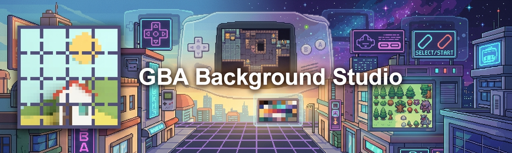
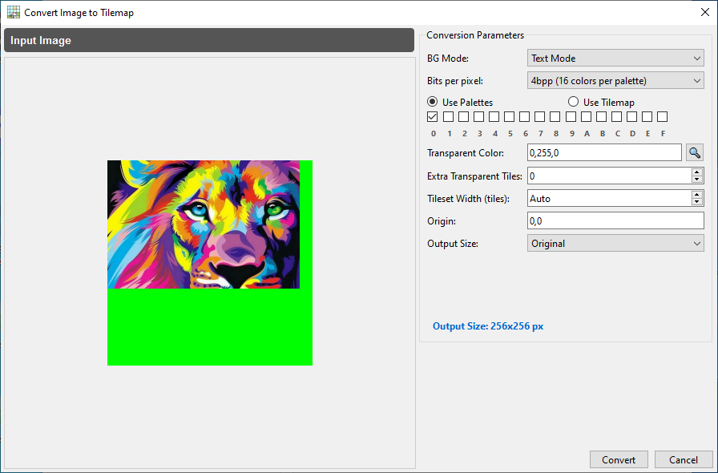
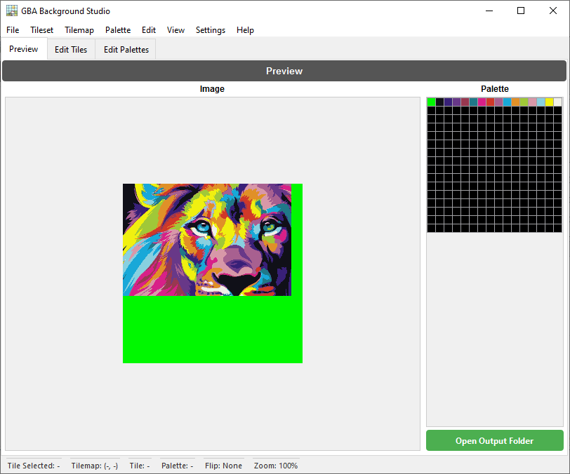
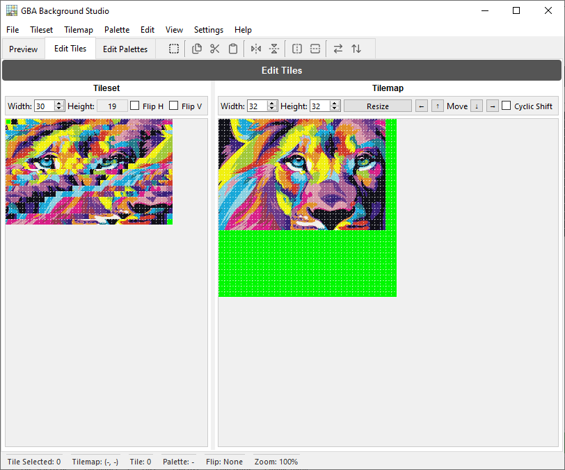
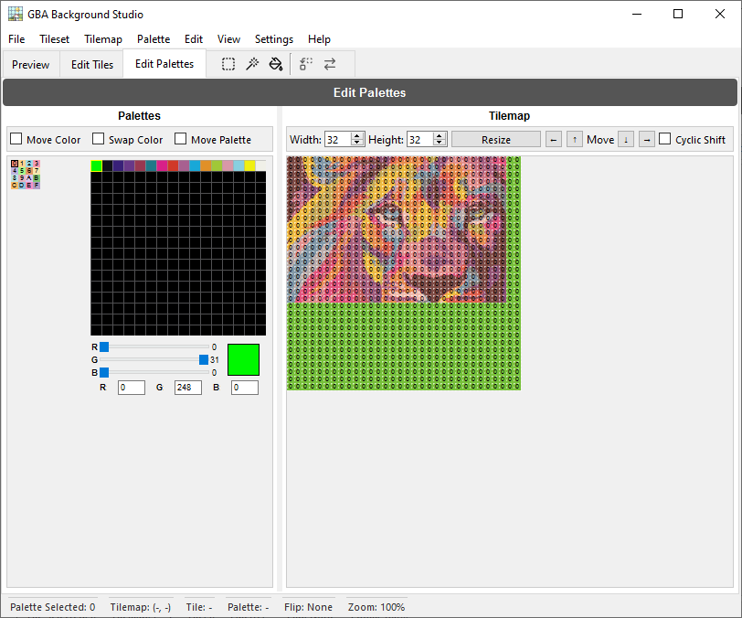

<p align="center"></p>
<div align="center"><a href="https://discord.gg/wsFFExCWFu"></a></div>

## GBA Background Studio

**GBA Background Studio** is a desktop application for creating and editing **Game Boy Advance (GBA) backgrounds**. It allows you to convert images into GBA-compatible tilesets and tilemaps, edit tiles and palettes visually, and export ready-to-use assets for your GBA projects.

> ⚠️ This application is designed for developers, ROM hackers, and pixel artists who need fine-grained control over GBA backgrounds.

---

## 🌐 Translations

This README is available in the following languages:

<p align="center">
  <a href="README.md">English</a> | <a href="README.spa.md">Español</a> | <a href="README.brp.md">Português (BR)</a> | <a href="README.fra.md">Français</a> | <a href="README.deu.md">Deutsch</a> | <a href="README.ita.md">Italiano</a> | <a href="README.por.md">Português</a> | <a href="README.nld.md">Nederlands</a> | <a href="README.pol.md">Polski</a><br>
  <a href="README.tur.md">Türkçe</a> | <a href="README.vie.md">Tiếng Việt</a> | <a href="README.ind.md">Bahasa Indonesia</a> | <a href="README.hin.md">हिन्दी</a> | <a href="README.rus.md">Русский</a> | <a href="README.jpn.md">日本語</a> | <a href="README.zhs.md">简体中文</a> | <a href="README.zht.md">繁體中文</a> | <a href="README.kor.md">한국어</a>
</p>

---

## ✨ Features

- **Image to GBA conversion**
  - Convert standard images into GBA-friendly tilesets and tilemaps.
  - Configure output size and color depth (4bpp and 8bpp).
  - Preview the result before exporting.

- **Tileset editing**
  - Visual tile selection and editing.
  - Interactive drawing tools on the tilemap grid.
  - Zoom levels from \(100\%\) to \(800\%\) for pixel-perfect editing.

- **Palette editing**
  - Edit up to 256 colors per palette.
  - Synchronize palette changes with previews and tiles.
  - Reorder, replace, or tweak individual colors.

- **Preview tab**
  - See how your final background will look on a GBA-like screen.
  - Quickly validate tile and palette configurations.

- **Undo / Redo history**
  - Comprehensive history tracking for edits.
  - Undo and redo operations with a large history buffer.

- **Configurable UI & status bar**
  - Detailed status bar with tile selection, tilemap coordinates, palette ID, flip state, and zoom level.
  - Context-sensitive toolbar per tab (preview, tiles, palettes).

- **Multi-language support**
  - Internal translation system (Translator) with language selection via configuration.
  - Designed to support multiple languages in the UI.

---

## 🖼️ Screenshots

<p align="center"></p>

<p align="center"></p>

<p align="center"></p>

<p align="center"></p>

---

## 🏗️ Architecture Overview

GBA Background Studio is built with **Python** and **PySide6**, and follows a modular UI design:

- **Main window (`GBABackgroundStudio`)**
  - Manages application state (current BPP, zoom level, tile and palette selection).
  - Hosts the main tabs and the custom status bar.
  - Loads and applies configuration (including last session output).

- **Tabs**
  - `PreviewTab` – GBA-style preview of the background.
  - `EditTilesTab` – Tile and tilemap editing tools.
  - `EditPalettesTab` – Palette editor and color manipulation tools.

- **UI components & utilities**
  - `MenuBar` – File operations (open image, export files, exit) and editor actions.
  - `CustomGraphicsView` – Extended `QGraphicsView` with tile-based interaction (hover, drawing, selection, paste preview).
  - `TilemapUtils` – Shared logic for tilemap interaction and selection.
  - `HistoryManager` – Undo/redo management for editor operations.
  - `HoverManager`, `GridManager` – Visual helpers for hover effects and grid overlays.
  - `Translator`, `ConfigManager` – Localization and persistent configuration.

---

## 📦 Installation

### Requirements
- **Python** (3.12+ recommended)
- **Pip** (Python package manager)
- **Operating System Support for PySide6:**
  - **Windows:** Windows 10 (Version 1809) or later.
  - **macOS:** macOS 11 (Big Sur) or later.
  - **Linux:** Modern distributions with glibc 2.28 or later (e.g., Ubuntu 20.04+, Debian 11+).

### Dependencies
Core dependencies include:
- `PySide6` (Qt for Python) - *Note: Requires the OS versions mentioned above.*
- `Pillow` (PIL) for image processing

You can install dependencies using:
```bash
pip install -r requirements.txt
```

---

### 🏛️ Legacy OS Support (Windows 7 / 8 / 8.1)
If you are using an older version of Windows that does not support **PySide6** (the GUI framework), you can still use the core conversion engine through our **Multi-language Command Line Wizard**.

#### Requirements
- **Python** (3.8+ recommended)

This allows you to convert images to GBA assets without the graphical interface, using a step-by-step guided assistant in your native language.

1. Navigate to the project root.
2. Run the **`GBA_Studio_Wizard.bat`** file.
3. Select your language (18 languages supported).
4. Follow the instructions to drag and drop your image and configure the GBA output.

---

## 🚀 Getting Started

1. **Clone the repository**

   ```bash
   git clone https://github.com/CompuMaxx/gba-background-studio.git
   cd gba-background-studio
   ```

2. **Create and activate a virtual environment** (optional but recommended)

   ```bash
   python -m venv .venv
   source .venv/bin/activate   # On Windows: .venv\Scripts\activate
   ```

3. **Install dependencies**

   ```bash
   pip install -r requirements.txt
   ```

4. **Run the application**

   ```bash
   python main.py
   ```

---

## 🧭 Basic Usage

1. **Open an Image**
   - Go to **File → Open Image** or press `Ctrl+O`.
   - Select the image you want to convert into a GBA background.

2. **Configure Conversion**
   - Select the **BG Mode** (**Text Mode** or **Rotation/Scaling Mode**).
   - Choose the palette(s) or Tilemap to use (only for **4bpp Text Mode**).
   - Set the color to be used as transparent.
   - Adjust the output size and other necessary parameters.
   - Click **Convert**, and the app will handle the rest for you.

3. **Edit Tiles**
   - Switch to the **Edit Tiles** tab.
   - Use the tilemap view to draw and modify individual tiles.
   - Select entire areas to copy, cut, paste, or rotate groups of tiles.
   - Synchronize changes in real-time to see instant results.
   - Adjust the **Zoom** level for perfect precision.
   - Optimize or Deoptimize tilesets to save space or ensure hardware compatibility.
   - Convert assets between **4bpp** and **8bpp** formats.
   - Switch between **Text Mode** and **Rotation/Scaling Mode** seamlessly.

4. **Edit Palettes**
   - Go to the **Edit Palettes** tab.
   - Modify colors in the palette grid and fine-tune them using the color editor.
   - Select specific areas or all tiles belonging to a palette to replace or swap them with another.

5. **Preview the Background**
   - Switch to the **Preview** tab for a high-fidelity representation of how it will look on an actual GBA.
   - Verify that your tile and palette configurations work perfectly together.

6. **Export Assets**
   - Go to **File → Export Files** or press `Ctrl+E`.
   - Export tilesets, tilemaps, and palettes in formats ready to be integrated into your GBA development toolchain.
   - Export individual assets separately from their respective menus if needed.

---

## 🔄 Undo / Redo

The application tracks your editing actions using a **history manager**:

- **Undo** – revert the last operation.
- **Redo** – re-apply an operation that was undone.

The history system keeps a buffer of recent states, including tile edits, palette changes, and tilemap operations.

---

## ⚙️ Configuration & Localization

### Configuration

The app uses a configuration manager to store settings such as:

- Last used language
- Last used zoom level
- Whether to load the last output on startup
- Other UI and editor preferences

The configuration is loaded on startup and applied to the UI and menus.

### Localization

A `Translator` component handles the UI text:

- Default language is configured through the settings.
- Translation files can be added or edited to support more languages.
- UI texts (menus, dialogs, labels) are passed through the translator.

---

## 🤝 Contributing

Contributions are welcome! If you'd like to help:

1. Fork this repository.
2. Create a feature branch:
   ```bash
   git checkout -b feature/my-new-feature
   ```
3. Commit your changes:
   ```bash
   git commit -am "Add my new feature"
   ```
4. Push the branch:
   ```bash
   git push origin feature/my-new-feature
   ```
5. Open a Pull Request describing your changes.

Please keep your code consistent with the existing style and include tests when possible.

---

## 📄 License

This project is licensed under the **GNU General Public License v3.0 (GPL-3.0)**.  
See the [LICENSE](LICENSE) file for more details.

---

## 🙏 Acknowledgments

- Thanks to the GBA homebrew and ROM hacking communities for their documentation and tools.
- Inspired by classic pixel art editors and GBA development utilities.

---

## 📩 Contact & Support

<p align="left">
  <a href="https://discord.gg/wsFFExCWFu">
    
  </a>
</p>

If you find this tool useful and would like to support its development, consider buying me a coffee!

[](https://ko-fi.com/compumax)

---
