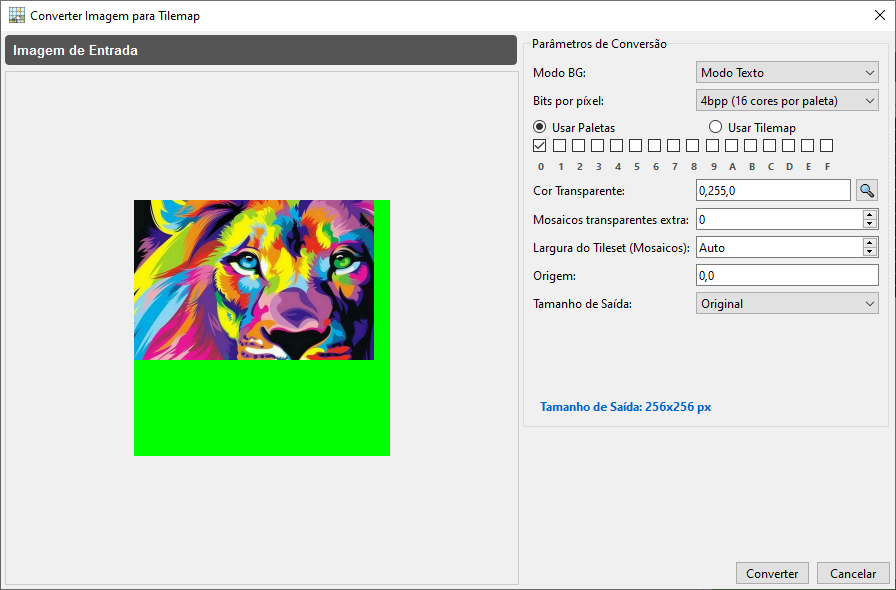
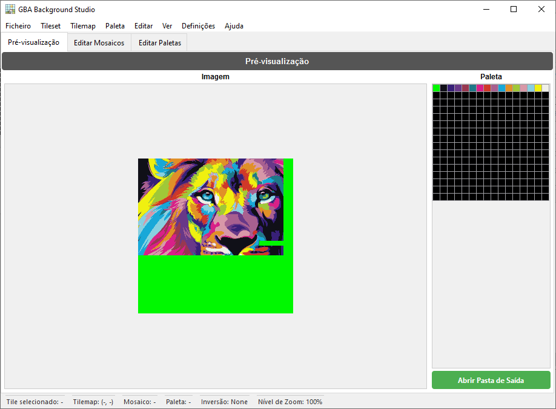
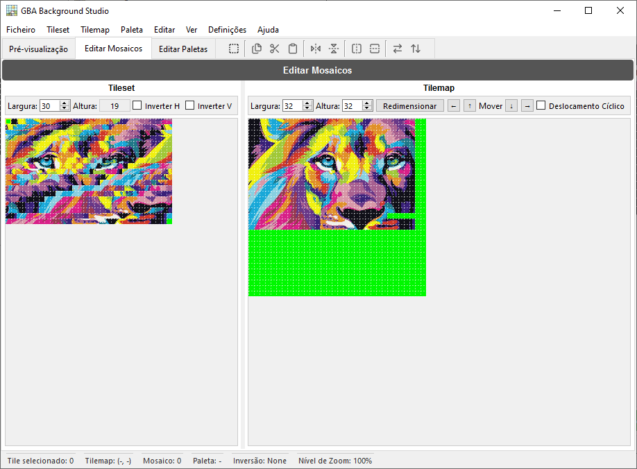
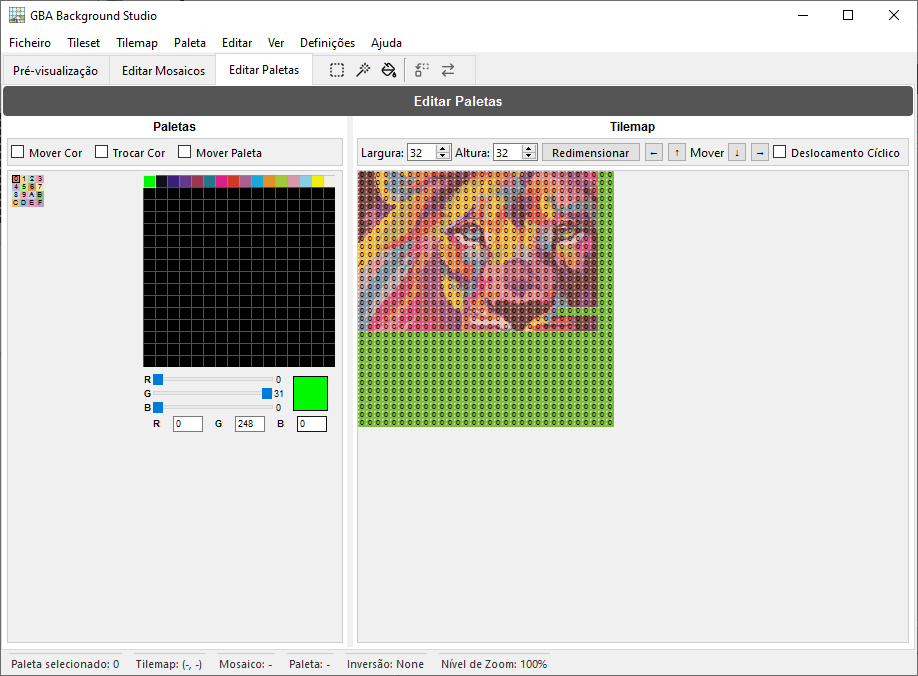

<p align="center"></p>
<div align="center"><a href="https://discord.gg/wsFFExCWFu"></a></div>

## GBA Background Studio

**GBA Background Studio** é uma aplicação de ambiente de trabalho para criar e editar **fundos do Game Boy Advance (GBA)**. Permite converter imagens em tilesets e tilemaps compatíveis com GBA, editar mosaicos e paletas visualmente, e exportar assets prontos a usar nos seus projetos GBA.

> ⚠️ Esta aplicação foi concebida para programadores, ROM hackers e pixel artists que necessitam de controlo preciso sobre os fundos do GBA.

---

## 🌐 Traduções

Este README está disponível nos seguintes idiomas:

<p align="center">
  <a href="README.md">English</a> | <a href="README.spa.md">Español</a> | <a href="README.brp.md">Português (BR)</a> | <a href="README.fra.md">Français</a> | <a href="README.deu.md">Deutsch</a> | <a href="README.ita.md">Italiano</a> | <a href="README.por.md">Português</a> | <a href="README.nld.md">Nederlands</a> | <a href="README.pol.md">Polski</a><br>
  <a href="README.tur.md">Türkçe</a> | <a href="README.vie.md">Tiếng Việt</a> | <a href="README.ind.md">Bahasa Indonesia</a> | <a href="README.hin.md">हिन्दी</a> | <a href="README.rus.md">Русский</a> | <a href="README.jpn.md">日本語</a> | <a href="README.zhs.md">简体中文</a> | <a href="README.zht.md">繁體中文</a> | <a href="README.kor.md">한국어</a>
</p>

---

## ✨ Funcionalidades

- **Conversão de imagem para GBA**
  - Converte imagens padrão em tilesets e tilemaps compatíveis com GBA.
  - Configura o tamanho de saída e a profundidade de cor (4bpp e 8bpp).
  - Pré-visualização do resultado antes de exportar.

- **Edição de Mosaicos**
  - Seleção e edição visual de mosaicos.
  - Ferramentas de desenho interativas na grelha do tilemap.
  - Níveis de zoom de 100% a 800% para edição pixel a pixel.

- **Edição de Paletas**
  - Edite até 256 cores por paleta.
  - Sincronize as alterações de paleta com as pré-visualizações e os mosaicos.
  - Reordene, substitua ou ajuste cores individuais.

- **Separador de Pré-visualização**
  - Visualize como ficará o seu fundo final num ecrã semelhante ao GBA.
  - Valide rapidamente as configurações de mosaicos e paletas.

- **Histórico de Anular/Refazer**
  - Rastreamento completo do histórico de edições.
  - Operações de anular e refazer com um amplo buffer de histórico.

- **Interface e barra de estado configuráveis**
  - Barra de estado detalhada com seleção de mosaico, coordenadas do tilemap, ID de paleta, estado de inversão e nível de zoom.
  - Barra de ferramentas contextual por separador (pré-visualização, mosaicos, paletas).

- **Suporte multilingue**
  - Sistema de tradução interno (Translator) com seleção de idioma através das definições.
  - Concebido para suportar múltiplos idiomas na interface.

---

## 🖼️ Capturas de Ecrã

<p align="center"></p>

<p align="center"></p>

<p align="center"></p>

<p align="center"></p>

---

## 🏗️ Descrição da Arquitetura

GBA Background Studio é construído com **Python** e **PySide6**, seguindo um design de interface modular:

- **Janela principal (`GBABackgroundStudio`)**
  - Gere o estado da aplicação (BPP atual, nível de zoom, seleção de mosaico e paleta).
  - Aloja os separadores principais e a barra de estado personalizada.
  - Carrega e aplica a configuração (incluindo a última sessão de saída).

- **Separadores**
  - `PreviewTab` – Pré-visualização do fundo ao estilo GBA.
  - `EditTilesTab` – Ferramentas de edição de mosaicos e tilemap.
  - `EditPalettesTab` – Editor de paletas e ferramentas de manipulação de cores.

- **Componentes e utilitários da interface**
  - `MenuBar` – Operações de ficheiro (abrir imagem, exportar ficheiros, sair) e ações do editor.
  - `CustomGraphicsView` – `QGraphicsView` alargado com interação baseada em mosaicos.
  - `TilemapUtils` – Lógica partilhada para interação e seleção do tilemap.
  - `HistoryManager` – Gestão de anular/refazer para operações do editor.
  - `HoverManager`, `GridManager` – Auxiliares visuais para efeitos de hover e sobreposições de grelha.
  - `Translator`, `ConfigManager` – Localização e configuração persistente.

---

## 📦 Instalação

### Requisitos
- **Python** (3.12+ recomendado)
- **Pip** (Gestor de pacotes Python)
- **Sistemas Operativos compatíveis com PySide6:**
  - **Windows:** Windows 10 (Versão 1809) ou superior.
  - **macOS:** macOS 11 (Big Sur) ou superior.
  - **Linux:** Distribuições modernas com glibc 2.28 ou superior.

### Dependências
As dependências principais incluem:
- `PySide6` (Qt para Python) - *Nota: Requer as versões de SO mencionadas acima.*
- `Pillow` (PIL) para processamento de imagem.

Pode instalar as dependências usando:
```bash
pip install -r requirements.txt
```

---

### 🏛️ Suporte para Sistemas Legados (Windows 7 / 8 / 8.1)
Se estiver a usar uma versão antiga do Windows que não suporta o **PySide6** (a interface gráfica), ainda poderá usar o motor de conversão através do nosso **Assistente de Linha de Comando Multilingue**.

#### Requisitos
- **Python** (3.8+ recomendado)

Isto permite converter imagens em assets de GBA sem a interface gráfica, usando um assistente guiado passo a passo no seu idioma nativo.

1. Navegue até à raiz do projeto.
2. Execute o ficheiro **`GBA_Studio_Wizard.bat`**.
3. Selecione o seu idioma (18 idiomas suportados).
4. Siga as instruções para arrastar a sua imagem e configurar a saída para GBA.

---

## 🚀 Primeiros Passos

1. **Clonar o repositório**

   ```bash
   git clone https://github.com/CompuMaxx/gba-background-studio.git
   cd gba-background-studio
   ```

2. **Criar e ativar um ambiente virtual** (opcional mas recomendado)

   ```bash
   python -m venv .venv
   source .venv/bin/activate   # No Windows: .venv\Scripts\activate
   ```

3. **Instalar as dependências**

   ```bash
   pip install -r requirements.txt
   ```

4. **Executar a aplicação**

   ```bash
   python main.py
   ```

---

## 🧭 Utilização Básica

1. **Abrir uma Imagem**
   - Vá a **Ficheiro → Abrir Imagem** ou prima `Ctrl+O`.
   - Selecione a imagem que pretende converter num fundo GBA.

2. **Configurar a Conversão**
   - Selecione o **Modo BG** (**Modo Texto** ou **Rotação/Escala**).
   - Escolha a(s) paleta(s) ou Tilemap a utilizar (apenas para **Modo Texto 4bpp**).
   - Defina a cor que será utilizada como transparente.
   - Ajuste o tamanho de saída e outros parâmetros necessários.
   - Clique em **Converter** e a aplicação trata do resto.

3. **Editar Mosaicos**
   - Mude para o separador **Editar Mosaicos**.
   - Use a vista do tilemap para desenhar e modificar mosaicos individuais.
   - Selecione áreas completas para copiar, cortar, colar ou rodar grupos de mosaicos.
   - Sincronize as alterações em tempo real para ver resultados instantâneos.
   - Ajuste o nível de **Zoom** para precisão perfeita.
   - Optimizar ou Desoptimizar Mosaicos para poupar espaço ou garantir compatibilidade com o hardware.
   - Converter assets entre os formatos **4bpp** e **8bpp**.
   - Alternar entre **Modo Texto** e **Rotação/Escala** sem problemas.

4. **Editar Paletas**
   - Vá ao separador **Editar Paletas**.
   - Modifique as cores na grelha de paletas e ajuste-as com o editor de cores.
   - Selecione áreas específicas ou todos os mosaicos pertencentes a uma paleta para os substituir ou trocar por outra.

5. **Pré-visualização do Fundo**
   - Mude para o separador **Pré-visualização** para uma representação fiel de como ficará num GBA real.
   - Verifique se as suas configurações de mosaicos e paletas funcionam perfeitamente em conjunto.

6. **Exportar Assets**
   - Vá a **Ficheiro → Exportar Ficheiros** ou prima `Ctrl+E`.
   - Exporte tilesets, tilemaps e paletas em formatos prontos para integração na sua cadeia de ferramentas de desenvolvimento GBA.
   - Exporte assets individuais separadamente a partir dos respetivos menus se necessário.

---

## 🔄 Anular/Refazer

A aplicação rastreia as suas ações de edição usando um **gestor de histórico**:

- **Anular** – reverte a última operação.
- **Refazer** – reaplicar uma operação que foi anulada.

O sistema de histórico mantém um buffer de estados recentes, incluindo edições de mosaicos, alterações de paleta e operações de tilemap.

---

## ⚙️ Configuração e Localização

### Configuração

A aplicação usa um gestor de configuração para armazenar definições como:

- Último idioma utilizado
- Último nível de zoom utilizado
- Se deve carregar a última saída ao iniciar
- Outras preferências de interface e editor

A configuração é carregada ao iniciar e aplicada à interface e aos menus.

### Localização

Um componente `Translator` gere os textos da interface:

- O idioma predefinido é configurado através das definições.
- Os ficheiros de tradução podem ser adicionados ou editados para suportar mais idiomas.
- Os textos da interface (menus, diálogos, etiquetas) passam pelo tradutor.

---

## 🤝 Contribuir

As contribuições são bem-vindas! Se quiser ajudar:

1. Faça um fork deste repositório.
2. Crie um branch de funcionalidade:
   ```bash
   git checkout -b feature/minha-nova-funcionalidade
   ```
3. Confirme as suas alterações:
   ```bash
   git commit -am "Adicionar a minha nova funcionalidade"
   ```
4. Envie o branch:
   ```bash
   git push origin feature/minha-nova-funcionalidade
   ```
5. Abra um Pull Request descrevendo as suas alterações.

Por favor, mantenha o seu código consistente com o estilo existente e inclua testes quando possível.

---

## 📄 Licença

Este projeto está licenciado sob a **GNU General Public License v3.0 (GPL-3.0)**.  
Consulte o ficheiro [LICENSE](LICENSE) para mais detalhes.

---

## 🙏 Agradecimentos

- Obrigado às comunidades de homebrew e ROM hacking do GBA pela sua documentação e ferramentas.
- Inspirado em editores clássicos de pixel art e utilitários de desenvolvimento para GBA.

---

## 📩 Contacto e Suporte

<p align="left">
  <a href="https://discord.gg/wsFFExCWFu">
    
  </a>
</p>

Se achar esta ferramenta útil e quiser apoiar o seu desenvolvimento, considere convidar-me para um café!

[](https://ko-fi.com/compumax)

---
