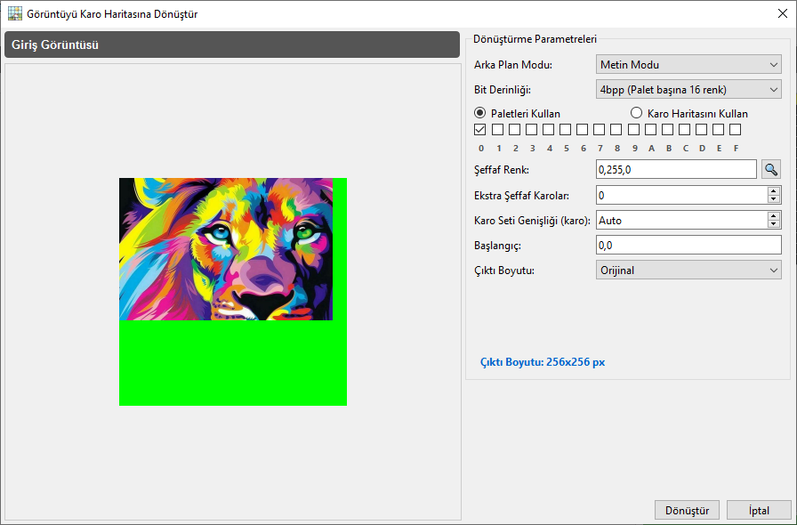
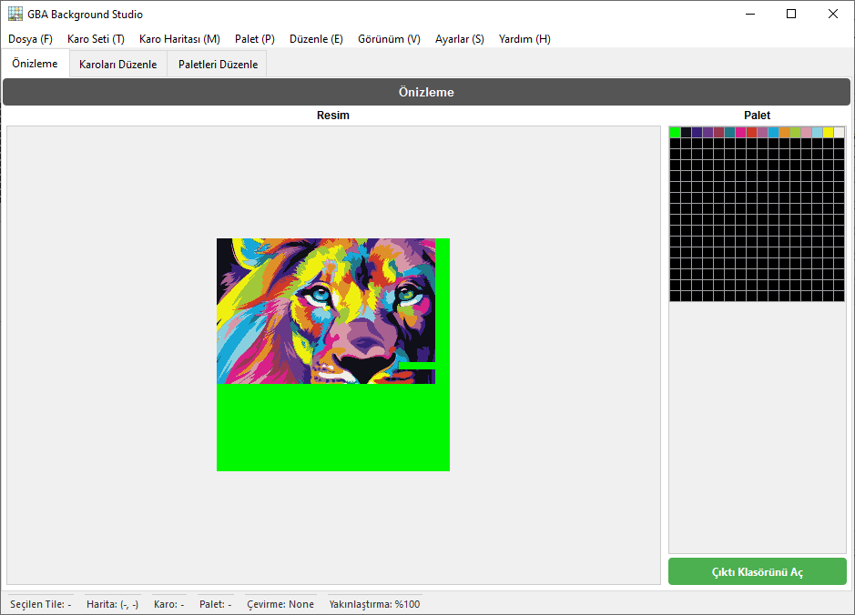
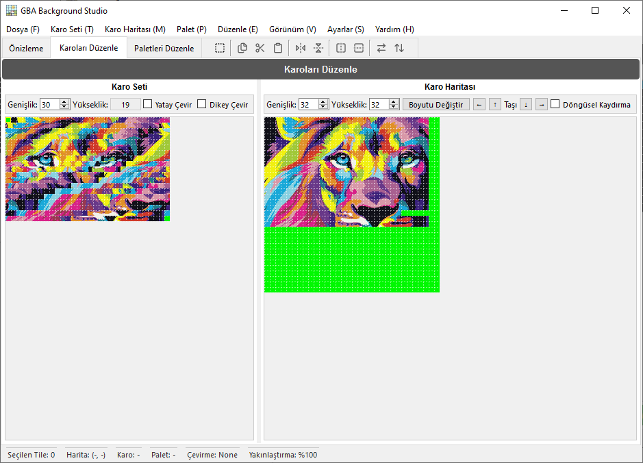
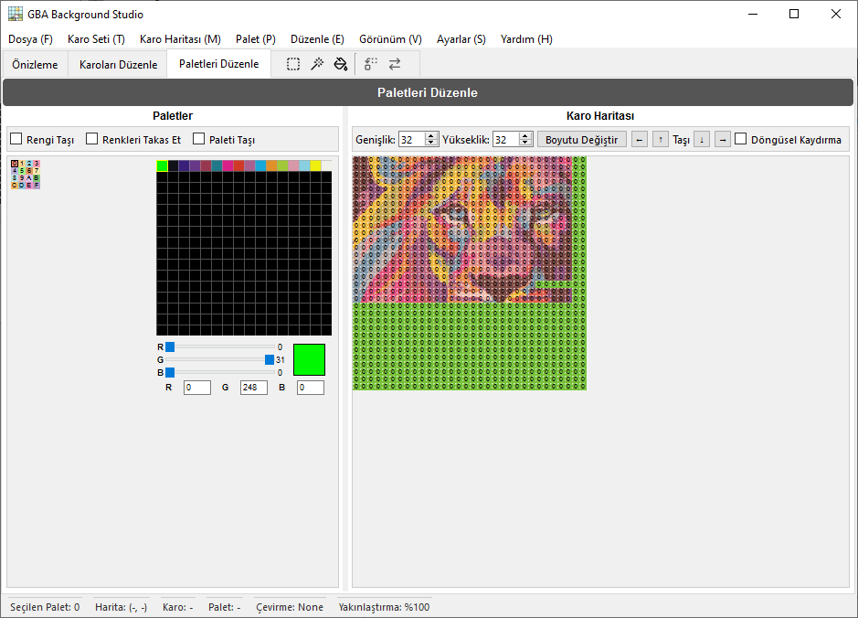

<p align="center"></p>
<div align="center"><a href="https://discord.gg/wsFFExCWFu"></a></div>

## GBA Background Studio

**GBA Background Studio**, **Game Boy Advance (GBA) arka planları** oluşturmak ve düzenlemek için bir masaüstü uygulamasıdır. Görüntüleri GBA uyumlu karo setlerine ve karo haritalarına dönüştürmenize, karoları ve paletleri görsel olarak düzenlemenize ve GBA projelerinizde kullanıma hazır varlıkları dışa aktarmanıza olanak tanır.

> ⚠️ Bu uygulama, GBA arka planları üzerinde hassas kontrole ihtiyaç duyan geliştiriciler, ROM hackerlar ve piksel sanatçıları için tasarlanmıştır.

---

## 🌐 Çeviriler

Bu README aşağıdaki dillerde mevcuttur:

<p align="center">
  <a href="README.md">English</a> | <a href="README.spa.md">Español</a> | <a href="README.brp.md">Português (BR)</a> | <a href="README.fra.md">Français</a> | <a href="README.deu.md">Deutsch</a> | <a href="README.ita.md">Italiano</a> | <a href="README.por.md">Português</a> | <a href="README.nld.md">Nederlands</a> | <a href="README.pol.md">Polski</a><br>
  <a href="README.tur.md">Türkçe</a> | <a href="README.vie.md">Tiếng Việt</a> | <a href="README.ind.md">Bahasa Indonesia</a> | <a href="README.hin.md">हिन्दी</a> | <a href="README.rus.md">Русский</a> | <a href="README.jpn.md">日本語</a> | <a href="README.zhs.md">简体中文</a> | <a href="README.zht.md">繁體中文</a> | <a href="README.kor.md">한국어</a>
</p>

---

## ✨ Özellikler

- **Görüntüden GBA'ya Dönüştürme**
  - Standart görüntüleri GBA uyumlu karo setlerine ve karo haritalarına dönüştürür.
  - Çıktı boyutunu ve renk derinliğini (4bpp ve 8bpp) yapılandırır.
  - Dışa aktarmadan önce sonucun önizlemesi.

- **Karoları Düzenle**
  - Karoların görsel seçimi ve düzenlenmesi.
  - Karo haritası ızgarasında etkileşimli çizim araçları.
  - Piksel piksel düzenleme için %100'den %800'e kadar yakınlaştırma seviyeleri.

- **Paletleri Düzenle**
  - Palet başına 256 renge kadar düzenleme.
  - Palet değişikliklerini önizlemeler ve karolarla senkronize etme.
  - Bireysel renkleri yeniden sıralama, değiştirme veya ayarlama.

- **Önizleme Sekmesi**
  - Son arka planınızın GBA benzeri bir ekranda nasıl görüneceğini görselleştirme.
  - Karo ve palet yapılandırmalarını hızlıca doğrulama.

- **Geri Al/Yinele Geçmişi**
  - Düzenleme geçmişinin tam takibi.
  - Geniş geçmiş tamponu ile geri alma ve yineleme işlemleri.

- **Yapılandırılabilir arayüz ve durum çubuğu**
  - Karo seçimi, karo haritası koordinatları, palet kimliği, çevirme durumu ve yakınlaştırma seviyesi içeren ayrıntılı durum çubuğu.
  - Sekme başına bağlamsal araç çubuğu (önizleme, karolar, paletler).

- **Çok dilli destek**
  - Ayarlar aracılığıyla dil seçimi ile dahili çeviri sistemi (Translator).
  - Arayüzde birden fazla dili desteklemek için tasarlanmış.

---

## 🖼️ Ekran Görüntüleri

<p align="center"></p>

<p align="center"></p>

<p align="center"></p>

<p align="center"></p>

---

## 🏗️ Mimari Açıklama

GBA Background Studio, **Python** ve **PySide6** ile oluşturulmuş olup modüler bir arayüz tasarımı izler:

- **Ana Pencere (`GBABackgroundStudio`)**
  - Uygulama durumunu yönetir (mevcut BPP, yakınlaştırma seviyesi, karo ve palet seçimi).
  - Ana sekmeleri ve özel durum çubuğunu barındırır.
  - Yapılandırmayı yükler ve uygular (son çıktı oturumu dahil).

- **Sekmeler**
  - `PreviewTab` – GBA tarzı arka plan önizlemesi.
  - `EditTilesTab` – Karo ve karo haritası düzenleme araçları.
  - `EditPalettesTab` – Palet düzenleyici ve renk manipülasyon araçları.

- **Arayüz bileşenleri ve yardımcı programlar**
  - `MenuBar` – Dosya işlemleri (görüntü aç, dosyaları dışa aktar, çıkış) ve düzenleyici eylemleri.
  - `CustomGraphicsView` – Karo tabanlı etkileşimli genişletilmiş `QGraphicsView`.
  - `TilemapUtils` – Karo haritası etkileşimi ve seçimi için paylaşılan mantık.
  - `HistoryManager` – Düzenleyici işlemleri için geri al/yinele yönetimi.
  - `HoverManager`, `GridManager` – Üzerine gelme efektleri ve ızgara katmanları için görsel yardımcılar.
  - `Translator`, `ConfigManager` – Yerelleştirme ve kalıcı yapılandırma.

---

## 📦 Kurulum

### Gereksinimler
- **Python** (3.12+ önerilir)
- **Pip** (Python paket yöneticisi)
- **PySide6 için İşletim Sistemi Desteği:**
  - **Windows:** Windows 10 (Sürüm 1809) veya üzeri.
  - **macOS:** macOS 11 (Big Sur) veya üzeri.
  - **Linux:** glibc 2.28 veya üzeri modern dağıtımlar.

### Bağımlılıklar
Temel bağımlılıklar şunları içerir:
- `PySide6` (Qt for Python) - *Not: Yukarıda belirtilen işletim sistemi sürümlerini gerektirir.*
- `Pillow` (PIL) görüntü işleme için.

Bağımlılıkları şu komutla yükleyebilirsiniz:
```bash
pip install -r requirements.txt
```

---

### 🏛️ Eski İşletim Sistemi Desteği (Windows 7 / 8 / 8.1)
**PySide6**'yı (grafik arayüz çerçevesi) desteklemeyen eski bir Windows sürümü kullanıyorsanız, temel dönüştürme motorunu **Çok Dilli Komut Satırı Sihirbazımız** aracılığıyla kullanmaya devam edebilirsiniz.

#### Gereksinimler
- **Python** (3.8+ önerilir)

Bu, grafik arayüz olmadan, ana dilinizde adım adım rehberli bir asistan kullanarak görüntüleri GBA varlıklarına dönüştürmenize olanak tanır.

1. Proje kök dizinine gidin.
2. **`GBA_Studio_Wizard.bat`** dosyasını çalıştırın.
3. Dilinizi seçin (18 dil desteklenmektedir).
4. Görüntünüzü sürükleyip bırakmak ve GBA çıktısını yapılandırmak için talimatları izleyin.

---

## 🚀 Başlarken

1. **Depoyu klonlayın**

   ```bash
   git clone https://github.com/CompuMaxx/gba-background-studio.git
   cd gba-background-studio
   ```

2. **Sanal ortam oluşturun ve etkinleştirin** (isteğe bağlı ama önerilir)

   ```bash
   python -m venv .venv
   source .venv/bin/activate   # Windows'ta: .venv\Scripts\activate
   ```

3. **Bağımlılıkları yükleyin**

   ```bash
   pip install -r requirements.txt
   ```

4. **Uygulamayı çalıştırın**

   ```bash
   python main.py
   ```

---

## 🧭 Temel Kullanım

1. **Görüntü Açma**
   - **Dosya → Görüntü Aç** seçeneğine gidin veya `Ctrl+O` tuşuna basın.
   - GBA arka planına dönüştürmek istediğiniz görüntüyü seçin.

2. **Dönüştürmeyi Yapılandırma**
   - **Arka Plan Modu**nu (**Metin Modu** veya **Döndürme/Ölçekleme**) seçin.
   - Kullanılacak palet(ler)i veya Karo Haritasını seçin (yalnızca **Metin Modu 4bpp** için).
   - Şeffaf olarak kullanılacak rengi ayarlayın.
   - Çıktı boyutunu ve diğer gerekli parametreleri ayarlayın.
   - **Dönüştür**'e tıklayın ve uygulama gerisini halleder.

3. **Karoları Düzenle**
   - **Karoları Düzenle** sekmesine geçin.
   - Bireysel karoları çizmek ve değiştirmek için karo haritası görünümünü kullanın.
   - Karo gruplarını kopyalamak, kesmek, yapıştırmak veya döndürmek için tam alanlar seçin.
   - Anlık sonuçlar için değişiklikleri gerçek zamanlı olarak senkronize edin.
   - Mükemmel hassasiyet için **Yakınlaştırma** seviyesini ayarlayın.
   - Alan tasarrufu yapmak veya donanım uyumluluğunu sağlamak için Karoları Optimize Et/Optimizasyonu Geri Al.
   - Varlıkları **4bpp** ve **8bpp** formatları arasında dönüştürün.
   - **Metin Modu** ve **Döndürme/Ölçekleme** arasında sorunsuzca geçiş yapın.

4. **Paletleri Düzenle**
   - **Paletleri Düzenle** sekmesine gidin.
   - Palet ızgarasındaki renkleri değiştirin ve renk düzenleyiciyle ayarlayın.
   - Bir palete ait belirli alanları veya tüm karoları seçerek başkasıyla değiştirin veya takas edin.

5. **Arka Plan Önizlemesi**
   - Gerçek bir GBA'da nasıl görüneceğinin sadık bir temsili için **Önizleme** sekmesine geçin.
   - Karo ve palet yapılandırmalarınızın birlikte mükemmel çalıştığını doğrulayın.

6. **Varlıkları Dışa Aktarma**
   - **Dosya → Dosyaları Dışa Aktar** seçeneğine gidin veya `Ctrl+E` tuşuna basın.
   - Karo setlerini, karo haritalarını ve paletleri GBA geliştirme araç zincirinize entegre etmeye hazır formatlarda dışa aktarın.
   - Gerekirse bireysel varlıkları ilgili menülerinden ayrı ayrı dışa aktarın.

---

## 🔄 Geri Al/Yinele

Uygulama, düzenleme eylemlerinizi bir **geçmiş yöneticisi** kullanarak takip eder:

- **Geri Al** – son işlemi geri alır.
- **Yinele** – geri alınan bir işlemi yeniden uygular.

Geçmiş sistemi, karo düzenlemeleri, palet değişiklikleri ve karo haritası işlemleri dahil olmak üzere son durumların bir tamponunu korur.

---

## ⚙️ Yapılandırma ve Yerelleştirme

### Yapılandırma

Uygulama, aşağıdaki gibi ayarları depolamak için bir yapılandırma yöneticisi kullanır:

- Son kullanılan dil
- Son kullanılan yakınlaştırma seviyesi
- Başlangıçta son çıktının yüklenip yüklenmeyeceği
- Diğer arayüz ve düzenleyici tercihleri

Yapılandırma başlangıçta yüklenir ve arayüze ve menülere uygulanır.

### Yerelleştirme

Bir `Translator` bileşeni arayüz metinlerini yönetir:

- Varsayılan dil ayarlar aracılığıyla yapılandırılır.
- Daha fazla dili desteklemek için çeviri dosyaları eklenebilir veya düzenlenebilir.
- Arayüz metinleri (menüler, iletişim kutuları, etiketler) çevirmen aracılığıyla işlenir.

---

## 🤝 Katkıda Bulunma

Katkılar memnuniyetle karşılanır! Yardım etmek istiyorsanız:

1. Bu depoyu fork edin.
2. Bir özellik dalı oluşturun:
   ```bash
   git checkout -b feature/yeni-ozelligim
   ```
3. Değişikliklerinizi commit edin:
   ```bash
   git commit -am "Yeni özelliğimi ekle"
   ```
4. Dalı push edin:
   ```bash
   git push origin feature/yeni-ozelligim
   ```
5. Değişikliklerinizi açıklayan bir Pull Request açın.

Lütfen kodunuzu mevcut stille tutarlı tutun ve mümkün olduğunda testler ekleyin.

---

## 📄 Lisans

Bu proje **GNU General Public License v3.0 (GPL-3.0)** altında lisanslanmıştır.  
Daha fazla ayrıntı için [LICENSE](LICENSE) dosyasına bakın.

---

## 🙏 Teşekkürler

- Belgeleri ve araçları için GBA homebrew ve ROM hacking topluluklarına teşekkürler.
- Klasik piksel sanat editörlerinden ve GBA geliştirme yardımcı programlarından ilham alınmıştır.

---

## 📩 İletişim ve Destek

<p align="left">
  <a href="https://discord.gg/wsFFExCWFu">
    
  </a>
</p>

Bu aracı yararlı buluyorsanız ve gelişimini desteklemek istiyorsanız, bana bir kahve ısmarlamayı düşünün!

[](https://ko-fi.com/compumax)

---
