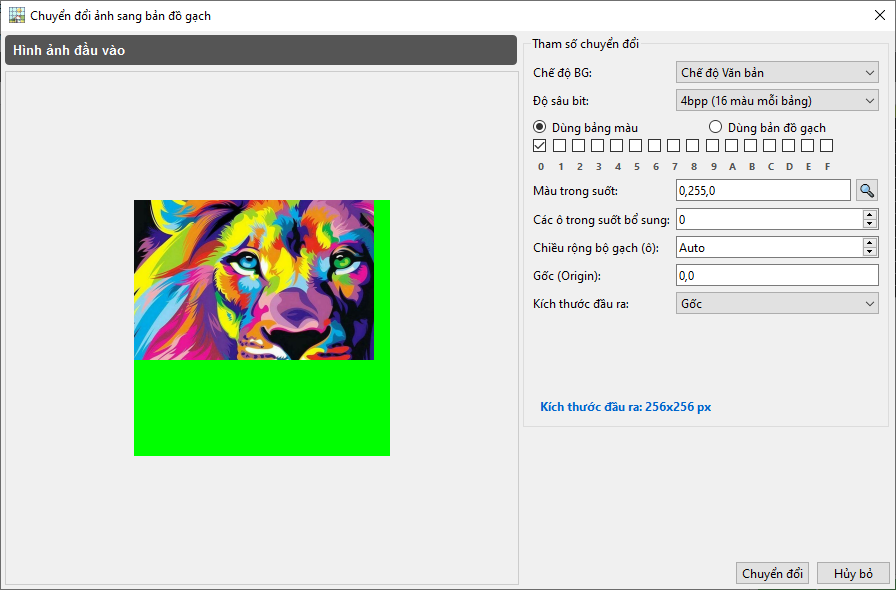
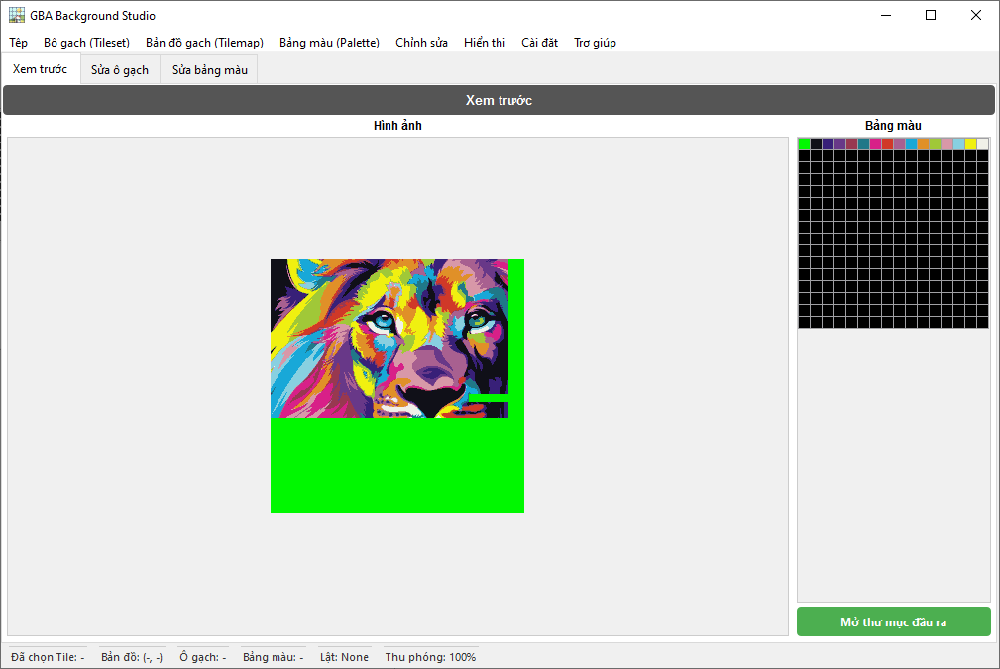
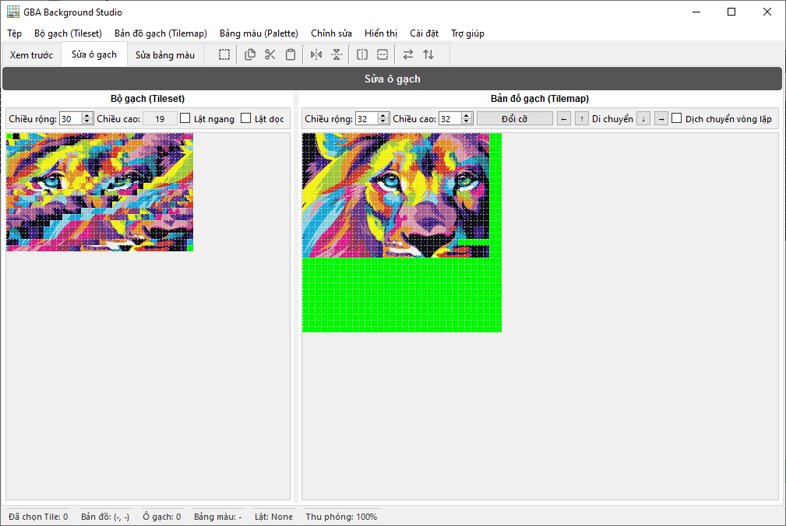
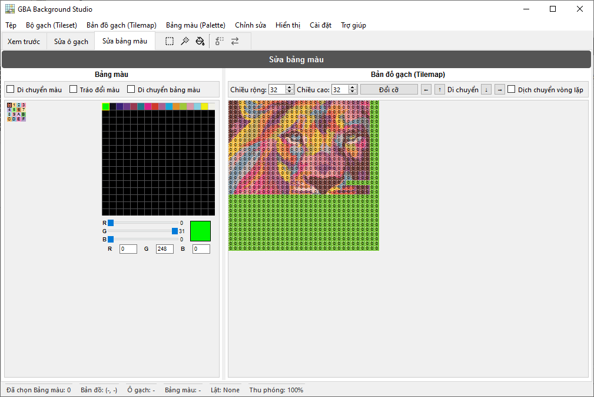

<p align="center"></p>
<div align="center"><a href="https://discord.gg/wsFFExCWFu"></a></div>

## GBA Background Studio

**GBA Background Studio** là ứng dụng máy tính để bàn dùng để tạo và chỉnh sửa **nền Game Boy Advance (GBA)**. Ứng dụng cho phép chuyển đổi hình ảnh thành tileset và tilemap tương thích GBA, chỉnh sửa ô gạch và bảng màu trực quan, và xuất các tài nguyên sẵn sàng sử dụng cho dự án GBA của bạn.

> ⚠️ Ứng dụng này được thiết kế cho các nhà phát triển, ROM hacker và pixel artist cần kiểm soát chính xác các nền GBA.

---

## 🌐 Bản dịch

README này có sẵn bằng các ngôn ngữ sau:

<p align="center">
  <a href="README.md">English</a> | <a href="README.spa.md">Español</a> | <a href="README.brp.md">Português (BR)</a> | <a href="README.fra.md">Français</a> | <a href="README.deu.md">Deutsch</a> | <a href="README.ita.md">Italiano</a> | <a href="README.por.md">Português</a> | <a href="README.nld.md">Nederlands</a> | <a href="README.pol.md">Polski</a><br>
  <a href="README.tur.md">Türkçe</a> | <a href="README.vie.md">Tiếng Việt</a> | <a href="README.ind.md">Bahasa Indonesia</a> | <a href="README.hin.md">हिन्दी</a> | <a href="README.rus.md">Русский</a> | <a href="README.jpn.md">日本語</a> | <a href="README.zhs.md">简体中文</a> | <a href="README.zht.md">繁體中文</a> | <a href="README.kor.md">한국어</a>
</p>

---

## ✨ Tính năng

- **Chuyển đổi hình ảnh sang GBA**
  - Chuyển đổi hình ảnh tiêu chuẩn thành tileset và tilemap tương thích GBA.
  - Cấu hình kích thước đầu ra và độ sâu màu (4bpp và 8bpp).
  - Xem trước kết quả trước khi xuất.

- **Sửa ô gạch**
  - Chọn và chỉnh sửa ô gạch trực quan.
  - Công cụ vẽ tương tác trên lưới tilemap.
  - Mức thu phóng từ 100% đến 800% để chỉnh sửa từng pixel.

- **Sửa bảng màu**
  - Chỉnh sửa tới 256 màu mỗi bảng màu.
  - Đồng bộ hóa thay đổi bảng màu với bản xem trước và ô gạch.
  - Sắp xếp lại, thay thế hoặc điều chỉnh màu sắc riêng lẻ.

- **Tab Xem trước**
  - Trực quan hóa nền cuối cùng trông như thế nào trên màn hình tương tự GBA.
  - Xác thực nhanh cấu hình ô gạch và bảng màu.

- **Lịch sử Hoàn tác/Làm lại**
  - Theo dõi đầy đủ lịch sử chỉnh sửa.
  - Các thao tác hoàn tác và làm lại với bộ đệm lịch sử rộng.

- **Giao diện và thanh trạng thái có thể cấu hình**
  - Thanh trạng thái chi tiết với lựa chọn ô gạch, tọa độ tilemap, ID bảng màu, trạng thái lật và mức thu phóng.
  - Thanh công cụ theo ngữ cảnh cho mỗi tab (xem trước, ô gạch, bảng màu).

- **Hỗ trợ đa ngôn ngữ**
  - Hệ thống dịch thuật nội bộ (Translator) với lựa chọn ngôn ngữ qua cài đặt.
  - Được thiết kế để hỗ trợ nhiều ngôn ngữ trong giao diện.

---

## 🖼️ Ảnh chụp màn hình

<p align="center"></p>

<p align="center"></p>

<p align="center"></p>

<p align="center"></p>

---

## 🏗️ Mô tả kiến trúc

GBA Background Studio được xây dựng bằng **Python** và **PySide6**, theo thiết kế giao diện mô-đun:

- **Cửa sổ chính (`GBABackgroundStudio`)**
  - Quản lý trạng thái ứng dụng (BPP hiện tại, mức thu phóng, lựa chọn ô gạch và bảng màu).
  - Chứa các tab chính và thanh trạng thái tùy chỉnh.
  - Tải và áp dụng cấu hình (bao gồm phiên đầu ra cuối cùng).

- **Các tab**
  - `PreviewTab` – Xem trước nền theo phong cách GBA.
  - `EditTilesTab` – Công cụ chỉnh sửa ô gạch và tilemap.
  - `EditPalettesTab` – Trình chỉnh sửa bảng màu và công cụ thao tác màu sắc.

- **Các thành phần và tiện ích giao diện**
  - `MenuBar` – Thao tác tệp (mở hình ảnh, xuất tệp, thoát) và các hành động trình chỉnh sửa.
  - `CustomGraphicsView` – `QGraphicsView` mở rộng với tương tác dựa trên ô gạch.
  - `TilemapUtils` – Logic dùng chung cho tương tác và lựa chọn tilemap.
  - `HistoryManager` – Quản lý hoàn tác/làm lại cho các thao tác trình chỉnh sửa.
  - `HoverManager`, `GridManager` – Trợ giúp trực quan cho hiệu ứng hover và lớp phủ lưới.
  - `Translator`, `ConfigManager` – Bản địa hóa và cấu hình liên tục.

---

## 📦 Cài đặt

### Yêu cầu
- **Python** (Khuyến nghị 3.12+)
- **Pip** (Trình quản lý gói Python)
- **Hỗ trợ hệ điều hành cho PySide6:**
  - **Windows:** Windows 10 (Phiên bản 1809) trở lên.
  - **macOS:** macOS 11 (Big Sur) trở lên.
  - **Linux:** Các bản phân phối hiện đại với glibc 2.28 trở lên.

### Các thư viện phụ thuộc
Các thư viện chính bao gồm:
- `PySide6` (Qt cho Python) - *Lưu ý: Yêu cầu các phiên bản hệ điều hành được đề cập ở trên.*
- `Pillow` (PIL) để xử lý hình ảnh.

Bạn có thể cài đặt các thư viện bằng lệnh:
```bash
pip install -r requirements.txt
```

---

### 🏛️ Hỗ trợ hệ điều hành cũ (Windows 7 / 8 / 8.1)
Nếu bạn đang sử dụng phiên bản Windows cũ hơn không hỗ trợ **PySide6** (khung giao diện đồ họa), bạn vẫn có thể sử dụng công cụ chuyển đổi cốt lõi thông qua **Trình hướng dẫn dòng lệnh đa ngôn ngữ** của chúng tôi.

#### Yêu cầu
- **Python** (Khuyến nghị 3.8+)

Điều này cho phép bạn chuyển đổi hình ảnh thành tài nguyên GBA mà không cần giao diện đồ họa, sử dụng hướng dẫn từng bước bằng ngôn ngữ mẹ đẻ của bạn.

1. Điều hướng đến thư mục gốc của dự án.
2. Chạy tệp **`GBA_Studio_Wizard.bat`**.
3. Chọn ngôn ngữ của bạn (hỗ trợ 18 ngôn ngữ).
4. Làm theo hướng dẫn để kéo và thả hình ảnh của bạn và cấu hình đầu ra GBA.

---

## 🚀 Bắt đầu

1. **Sao chép kho lưu trữ**

   ```bash
   git clone https://github.com/CompuMaxx/gba-background-studio.git
   cd gba-background-studio
   ```

2. **Tạo và kích hoạt môi trường ảo** (tùy chọn nhưng được khuyến nghị)

   ```bash
   python -m venv .venv
   source .venv/bin/activate   # Trên Windows: .venv\Scripts\activate
   ```

3. **Cài đặt các phụ thuộc**

   ```bash
   pip install -r requirements.txt
   ```

4. **Chạy ứng dụng**

   ```bash
   python main.py
   ```

---

## 🧭 Sử dụng cơ bản

1. **Mở hình ảnh**
   - Đi tới **Tệp → Mở hình ảnh** hoặc nhấn `Ctrl+O`.
   - Chọn hình ảnh bạn muốn chuyển đổi thành nền GBA.

2. **Cấu hình chuyển đổi**
   - Chọn **Chế độ BG** (**Chế độ Văn bản** hoặc **Xoay/Thu phóng**).
   - Chọn bảng màu hoặc Tilemap để sử dụng (chỉ cho **Chế độ Văn bản 4bpp**).
   - Đặt màu sẽ được sử dụng làm trong suốt.
   - Điều chỉnh kích thước đầu ra và các thông số cần thiết khác.
   - Nhấp vào **Chuyển đổi** và ứng dụng sẽ xử lý phần còn lại.

3. **Sửa ô gạch**
   - Chuyển sang tab **Sửa ô gạch**.
   - Sử dụng chế độ xem tilemap để vẽ và sửa đổi các ô gạch riêng lẻ.
   - Chọn toàn bộ khu vực để sao chép, cắt, dán hoặc xoay các nhóm ô gạch.
   - Đồng bộ hóa các thay đổi theo thời gian thực để xem kết quả tức thì.
   - Điều chỉnh mức **Thu phóng** để có độ chính xác hoàn hảo.
   - Tối ưu hóa/Hủy tối ưu hóa ô gạch để tiết kiệm không gian hoặc đảm bảo tương thích phần cứng.
   - Chuyển đổi tài nguyên giữa các định dạng **4bpp** và **8bpp**.
   - Chuyển đổi liền mạch giữa **Chế độ Văn bản** và **Xoay/Thu phóng**.

4. **Sửa bảng màu**
   - Đi tới tab **Sửa bảng màu**.
   - Sửa đổi màu sắc trong lưới bảng màu và điều chỉnh chúng bằng trình chỉnh sửa màu.
   - Chọn các khu vực cụ thể hoặc tất cả ô gạch thuộc một bảng màu để thay thế hoặc hoán đổi với bảng màu khác.

5. **Xem trước nền**
   - Chuyển sang tab **Xem trước** để có biểu diễn trung thực về cách nó sẽ trông trên GBA thực.
   - Xác minh rằng cấu hình ô gạch và bảng màu của bạn hoạt động hoàn hảo cùng nhau.

6. **Xuất tài nguyên**
   - Đi tới **Tệp → Xuất tệp** hoặc nhấn `Ctrl+E`.
   - Xuất tileset, tilemap và bảng màu ở các định dạng sẵn sàng tích hợp vào chuỗi công cụ phát triển GBA của bạn.
   - Xuất tài nguyên riêng lẻ từ menu tương ứng nếu cần.

---

## 🔄 Hoàn tác/Làm lại

Ứng dụng theo dõi các hành động chỉnh sửa của bạn bằng **trình quản lý lịch sử**:

- **Hoàn tác** – hoàn nguyên thao tác cuối cùng.
- **Làm lại** – áp dụng lại thao tác đã hoàn tác.

Hệ thống lịch sử duy trì bộ đệm các trạng thái gần đây, bao gồm chỉnh sửa ô gạch, thay đổi bảng màu và thao tác tilemap.

---

## ⚙️ Cấu hình và Bản địa hóa

### Cấu hình

Ứng dụng sử dụng trình quản lý cấu hình để lưu trữ các cài đặt như:

- Ngôn ngữ được sử dụng lần cuối
- Mức thu phóng được sử dụng lần cuối
- Có tải đầu ra cuối cùng khi khởi động không
- Các tùy chọn giao diện và trình chỉnh sửa khác

Cấu hình được tải khi khởi động và áp dụng cho giao diện và menu.

### Bản địa hóa

Thành phần `Translator` quản lý các văn bản giao diện:

- Ngôn ngữ mặc định được cấu hình thông qua cài đặt.
- Các tệp dịch có thể được thêm hoặc chỉnh sửa để hỗ trợ thêm ngôn ngữ.
- Văn bản giao diện (menu, hộp thoại, nhãn) đi qua trình dịch.

---

## 🤝 Đóng góp

Đóng góp được chào đón! Nếu bạn muốn giúp đỡ:

1. Fork kho lưu trữ này.
2. Tạo nhánh tính năng:
   ```bash
   git checkout -b feature/tinh-nang-moi-cua-toi
   ```
3. Commit các thay đổi của bạn:
   ```bash
   git commit -am "Thêm tính năng mới của tôi"
   ```
4. Push nhánh:
   ```bash
   git push origin feature/tinh-nang-moi-cua-toi
   ```
5. Mở Pull Request mô tả các thay đổi của bạn.

Vui lòng giữ mã của bạn nhất quán với phong cách hiện có và bao gồm các bài kiểm tra khi có thể.

---

## 📄 Giấy phép

Dự án này được cấp phép theo **GNU General Public License v3.0 (GPL-3.0)**.  
Xem tệp [LICENSE](LICENSE) để biết thêm chi tiết.

---

## 🙏 Lời cảm ơn

- Cảm ơn các cộng đồng homebrew và ROM hacking GBA vì tài liệu và công cụ của họ.
- Lấy cảm hứng từ các trình chỉnh sửa pixel art cổ điển và tiện ích phát triển GBA.

---

## 📩 Liên hệ và Hỗ trợ

<p align="left">
  <a href="https://discord.gg/wsFFExCWFu">
    
  </a>
</p>

Nếu bạn thấy công cụ này hữu ích và muốn hỗ trợ sự phát triển của nó, hãy cân nhắc mời tôi một ly cà phê!

[](https://ko-fi.com/compumax)

---
